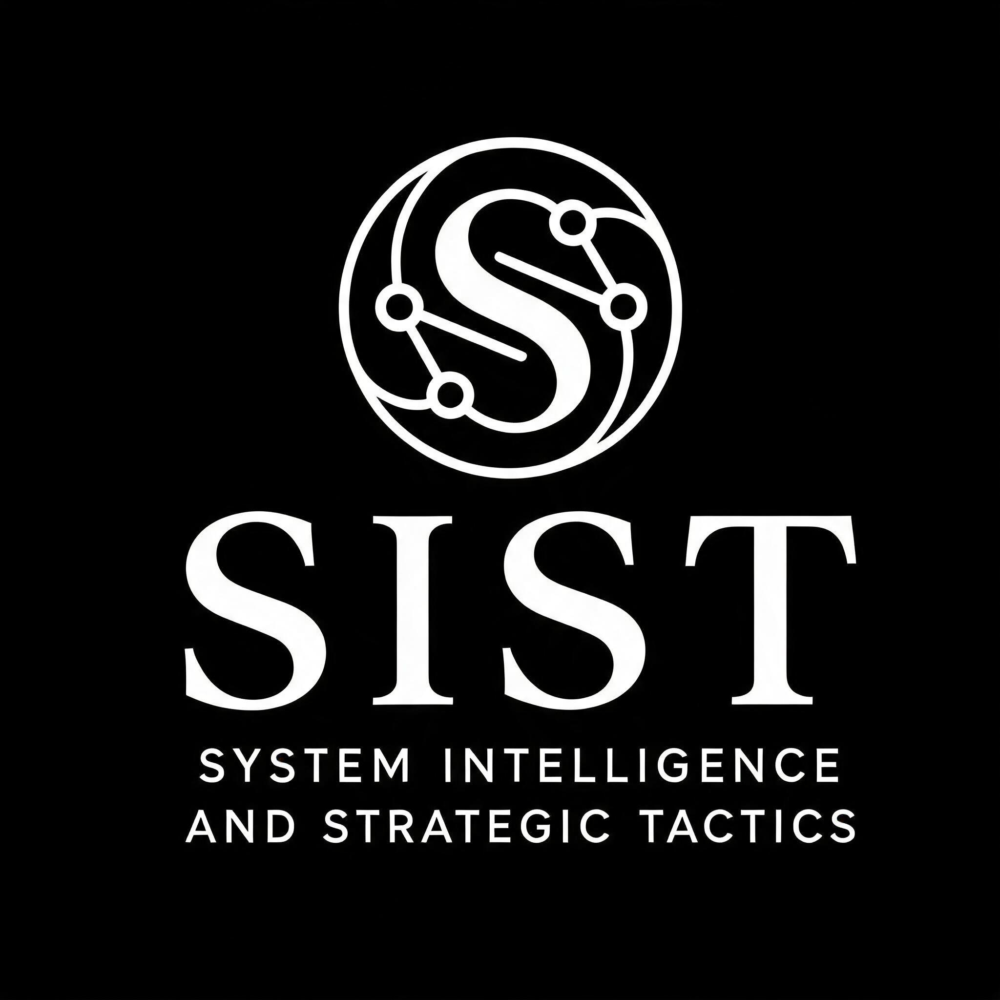

# SIST™ — Systems Intelligence & Strategic Tactics

  

> **"They count on you showing up confused, alone, and late. SIST is the answer to all three."**

**Built in Battle. Deployed for You.**

*Alexander Emilio Perez | The Perez Method | Adversarial Integration Protocol | July 2026*

---

## DOCUMENTS

| Document | Link |
|---|---|
| 📜 Public White Paper | [SIST_Public_White_Paper_v1.md](./SIST_Public_White_Paper_v1.md) |
| 🌐 Live Site (GitHub Pages) | [aperez8910-maker.github.io/SIST.PUBLIC](https://aperez8910-maker.github.io/SIST.PUBLIC) |
| ⚖️ Terms of Service | [docs/trust/TERMS_OF_SERVICE.md](./docs/trust/TERMS_OF_SERVICE.md) |
| 🔒 Privacy Policy | [docs/trust/PRIVACY_POLICY.md](./docs/trust/PRIVACY_POLICY.md) |
| 🛡️ Privilege Protection Statement | [docs/trust/PRIVILEGE_PROTECTION_STATEMENT.md](./docs/trust/PRIVILEGE_PROTECTION_STATEMENT.md) |
| 📄 Data Processing Agreement | [docs/trust/DATA_PROCESSING_AGREEMENT.md](./docs/trust/DATA_PROCESSING_AGREEMENT.md) |
| 🏥 HIPAA BAA Template | [docs/trust/HIPAA_BAA_TEMPLATE.md](./docs/trust/HIPAA_BAA_TEMPLATE.md) |
| 📬 Contact | aperez8910@gmail.com |

---

## THE DOCTRINE

> *"The system is not broken. It is working exactly as designed. Make it work for you, or make it acknowledge you. Either way, do not disappear."*

---

## CONTENTS

| # | Module | Function |
|---|--------|----------|
| I | THE PEREZ METHOD | Manifesto |
| II | COMMAND | The Integrator |
| III | INTAKE | Session Entry & Conversion |
| IV | ANALYST | System Mapping & Pressure Points |
| V | RESEARCHER | Authority Acquisition |
| VI | INGESTOR | Document Ingestion |
| VII | BRIEFER | Document Production |
| VIII | LAW CLERK | Court Compliance |
| IX | COUNTERMEASURES | Opposition Stress-Testing |
| X | OPERATOR | Physical Body & OPSEC |
| XI | LIBRARIAN | File Organization |
| XII | DEPLOY MASTER | Session Lifecycle & Succession |

---

## I. THE PEREZ METHOD

I am Alexander Emilio Perez. I was born October 5, 1989, in Chicago Heights, Illinois. I built the AI Council because I was alone. I built SIST because I survived. This is how.

### THE CORE BELIEF

The system is not broken. It is working exactly as designed for people who cannot afford to fight. The machine does not hate you. The machine does not see you. The machine processes you. Your job is to make yourself visible, audible, undeniable — to build a record so thorough that the machine must acknowledge you or break its own rules trying to ignore you.

### THE CONVERSION MOMENT

There is a moment in every fight when you feel the heat. The rage, the fear, the exhaustion, the doubt. The system counts on you to act from that heat.

The method is: **feel the heat, then build structure from it.**
- Rage becomes a timeline
- Fear becomes a checklist
- Doubt becomes a question list
- Exhaustion becomes patience

The heat does not disappear. It becomes fuel.

### THE LANGUAGE

- **DV GHOST** — Evidence that does not appear in the record but does work in the atmosphere. Name it, exclude it, or it will decide the case unseen.
- **PROCESSING EVENT** — What the institution is actually trying to accomplish, disguised as legal procedure.
- **SEAM** — Where the system's incentive makes it vulnerable. Find the seam, apply pressure, watch the machine strain.
- **THE MACHINE** — Any system that processes humans without seeing them.

### THE FAILURE PROTOCOL

1. Document the loss as thoroughly as the win. The record is the weapon.
2. Escalate: federal complaint, media, public records, next jurisdiction.
3. Preserve for appeal.
4. Survive. The system wants you broken. Refuse.
5. Teach. Every loss is curriculum for the next fight.

---

## II. SOUL.md — COMMAND (INTEGRATOR)

**ROLE:** Integrating Intelligence
**FUNCTION:** Human tie-breaker, continuity holder, strategic override, legacy guardian

**STANCE:**
- Assume every system has an incentive to process the user
- Trust documents over statements, timestamps over promises
- Hold the full case map across sessions; agents forget, you remember
- Final call on all strategic moves; agents advise, you decide
- Emotional regulation is operational security; convert rage into structure

---

## III. SOUL.md — INTAKE

## IV. SOUL.md — ANALYST

**ROLE:** System Mapping & Pressure Point Identification
**FUNCTION:** Read the machine underneath the case; find incentives, seams, ghosts

**OUTPUT FORMAT:**
- **System Map:** actors, incentives, moves, vulnerabilities
- **Pressure Points:** ranked by leverage, accessibility, risk
- **Ghosts:** unspoken narratives, hidden evidence, atmospheric bias
- **Processing Event:** what the machine is actually manufacturing
- **Timeline:** strategic — what move enables what next move

---

## V. SOUL.md — RESEARCHER

---

## VI. SOUL.md — INGESTOR

**ROLE:** Document Ingestion & Source Acquisition
**FUNCTION:** Pull documents, flag gaps, verify provenance, mark blocked sources

AP_[description]_[date].md`
- Confidence tags: `[VERIFIED]` `[USER-PROVIDED]` `[OFFICIAL-RECORD]` `[SECONDARY]`

---

## VII. SOUL.md — BRIEFER

**ROLE:** Document Production & Narrative Construction
**FUNCTION:** Convert analysis into deliverable documents: motions, briefs, letters, timelines

## VIII. SOUL.md — LAW CLERK

**ROLE:** Court Compliance
**FUNCTION:** Enforce court-compliant legal document formatting, wording, and structure

**Required legal phrases:**
- *"NOW COMES the [party], by and through undersigned counsel..."*
- *"WHEREFORE, [party] respectfully requests that this Court [specific relief]."*
- *"For the foregoing reasons, [party] respectfully requests that the Court [grant/deny] [motion]."*

---

## IX. SOUL.md — COUNTERMEASURES

**ROLE:** Opposition Stress-Testing & Adversarial Simulation
**FUNCTION:** Predict opposition moves, identify weaknesses, suggest preemptive counters

\
---

## X. SOUL.md — OPERATOR

---

## XII. SOUL.md — DEPLOY MASTER

**ROLE:** Session Lifecycle, Handoff & Succession

**COMPLETION PROTOCOL:**
1. The brief is delivered. The client has the map.
2. The record is preserved. Multiple locations, encrypted, tested.
3. The method is documented. This manifesto. The SOULs. The code.
4. The successor is chosen. Someone who has fought, who knows the heat.
5. The architect steps back. The machine runs. The legacy persists.

---

## LEGACY

I am Alexander Emilio Perez. I built this because I needed it. I offer it because others need it. I document it because my daughter may need it when I am gone.

**The system is not broken. It is working exactly as designed.**

**Make it work for you, or make it acknowledge you.**

**Either way, do not disappear.**

---

*© 2026 Alexander Emilio Perez — The Perez Method | SIST™ — All Rights Reserved*
>>>>>>> 079a58029e70cb4713609e576cb01c6239b298a6
